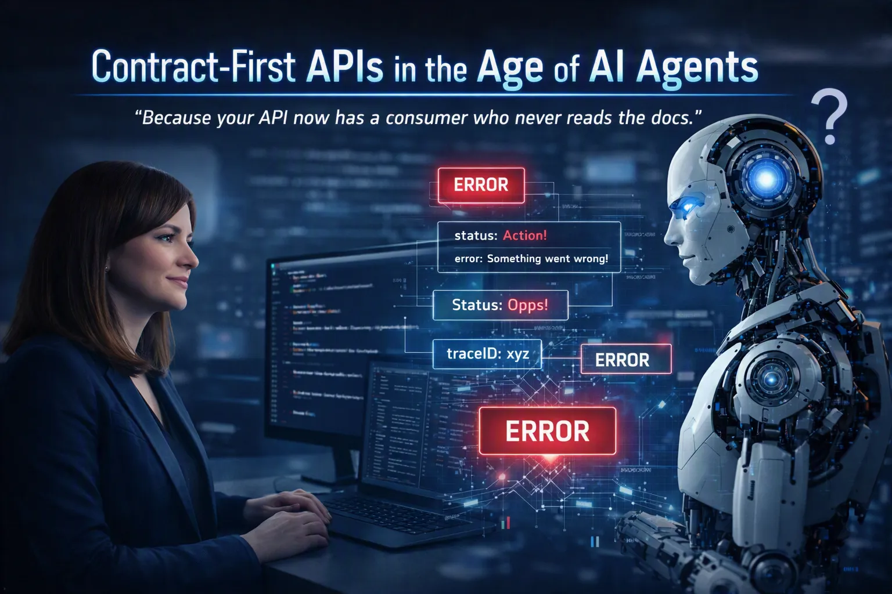

## Short Abstract

AI agents hit APIs without intuition or mercy. Loose statuses, vague errors, and missing idempotency turn into 2 AM incidents. Learn five contract‑first practices: structured statuses, actionable errors, idempotency, trace IDs, and consumer‑driven tests to keep systems reliable.
## Abstract

Your API now has a consumer who never reads the docs, never interprets ambiguity, and retries without mercy when something is unclear.

AI agents call production APIs at scale, and they are not like human developers. A freeform status field, an unstructured error message, or a missing idempotency key that a human works around in thirty seconds becomes an incident when an agent hits it at 2 AM.

Contract-first API design has always mattered. In the age of AI agents, it's the difference between a system that works and one that fails in ways that are genuinely hard to debug.

This session covers five concrete principles: enumerated status values, actionable error schemas, idempotency semantics, trace IDs as contract commitments, and consumer-driven contract testing, all grounded in real failure scenarios from the agent-integration frontier.

Leave with a checklist. Apply it Monday.

# Type
- 45/60-minute session

## Tags

    

## Learning Objectives
- **Design agent‑safe API contracts**

  Attendees will learn how to structure APIs so AI agents can consume them reliably — including enumerated status values, strict field semantics, and eliminating ambiguity that humans tolerate but agents cannot.

- **Implement actionable error and idempotency patterns**

  Attendees will understand how to design error schemas, idempotency semantics, and retry‑safe workflows that prevent agent‑driven incidents and support predictable automation at scale.

- **Apply observability and contract‑testing techniques**

  Attendees will learn how to use trace IDs as contractual commitments and how to apply consumer‑driven contract testing to validate agent integrations before they reach production.

## Presentations

| Event | Location | Date | Time | Room | Downloads |
|-------|:--------:|-----:|-----:|-----:|----------:|
| [API Conference New York 2026](https://apiconference.net/new-york/) | New York, NY | 2026-09-29 | 17:30 EDT | Sunset Park | [SLIDES](EventMaterials/ContractFirstAPIsInTheAgeOfAgents-APIConfNYC2026.pdf) |

Email [chadgreen@chadgreen.com](mailto:chadgreen@chadgreen.com?subject=Presentation%20Request:%20Presentation%20Title) to have Chad present this session at your event.

## Resources

- **OpenAPI Specification:** [openapis.org](https://openapis.org) — contract tooling, start here
- **Pact Framework:** [pact.io](https://pact.io) — consumer-driven contract testing, every major language
- **W3C Trace Context:** [w3.org/TR/trace-context](https://w3.org/TR/trace-context) — the traceparent header standard
- **MCP Specification:** [modelcontextprotocol.io](https://modelcontextprotocol.io) — agent discoverability protocol

